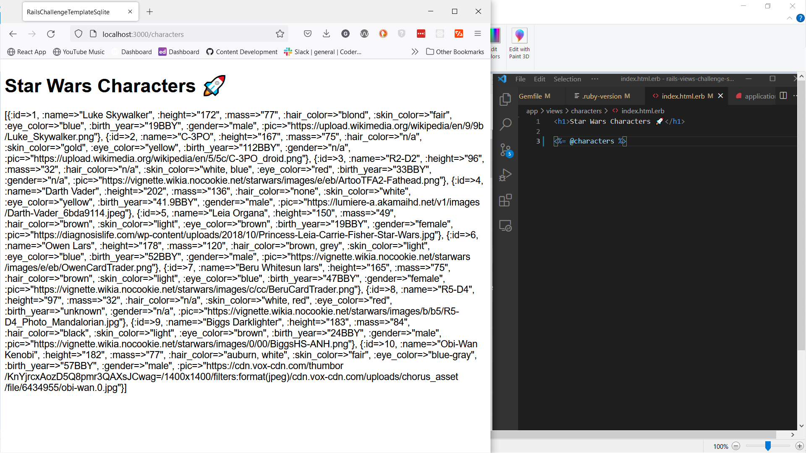
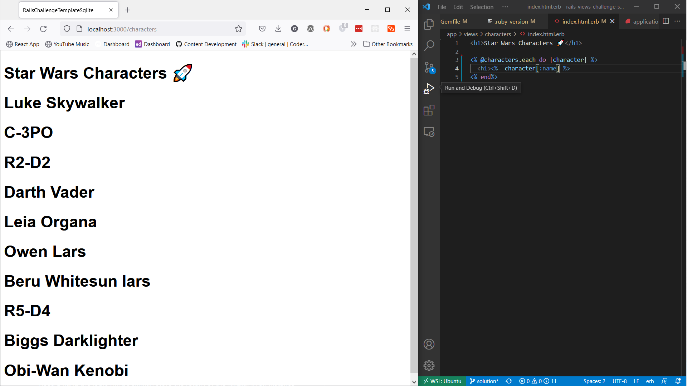

# Rails Star Wars App Views Challenge

## Setup

1. Make a fork of this repo
2. Clone your fork to your local development environment
3. Install dependencies bundle install
4. Check node dependencies `yarn install --check-files`
5. run `rails s` and check that everything is working (you should see welcome to rails!)

## Challenge

### Core

1. In this challenge we'll be focusing on views in a rails application. I've created [a video that shows the goal layout](https://www.youtube.com/watch?v=PhiNs3YuJ1Q). Try and meet this goal as closely as possible using CSS and ERB logic in your views. 
2. Generate a characters controller
3. Configure your `routes.rb` file, you're creating only two routes in this instance, you'll need routes to display all star wars characters and display one star wars character, to verify you've set your routes up correctly you can run `rails routes -c characters`, it should look something like this

    ```bash
    Prefix         Verb   URI Pattern                    Controller#Action
    characters     GET    /characters(.:format)          characters#index
    character      GET    /characters/:id(.:format)      characters#show
    ```
    
4. Define an index method in the characters controller 
5. In your `application_controller` we have a method `characters`, this sets an instance variable `@characters` which contains all the data we need to create the app, how can we run this method **before** our **actions** in `characters_controller`, we need to ensure we have access to the `@characters` instance variable in index
6. Add an `index.html.erb` file in app > views > characters
7. Add an `<h1>` to the page with "Star Wars Characters" inside it
8. What is the url to access this index page? open a browser and type the url to see your HTML rendered
9. As we have access to the instance variable `@characters` in the controller action, we'll be able to use it in our index view, using erb tags render the `@characters` array of hashes on the page, you should see something like this



10. Using erb notation loop through the `@characters` array with `.each` and display each character name in `<h1>` tags, it should look something like this



11. Underneath the name render out all of the attributes for a character (height, mass, hair color, skin color, eye color, birth year, gender)
12. There are a couple of "n/a" fields for droids next to the gender attribute, write some control flow logic using erb notation to ensure that the gender field doesn't appear if the gender value is "n/a", for example R2-D2 won't have `Gender: n/a`
13. We'll now focus on the show controller action and view, this will display 1 star wars character
14. Define a show controller action, in the action use `.find` on `@characters` to find the star wars character based on the params[:id] passed, refer to yesterdays lesson if you need a hand the logic will be similar, store the return of the `.find` in an instance variable `@character`
15. Add a `show.html.erb` file in app > views > characters
16. In show render out the individual characters name in an h1, if you go to `http://localhost:3000/characters/1` you should see this:


17. Next to the characters name render out the image using `image_tag`, you can find the image src in the data hash.  It will look weird right now without any CSS, lets fix that
18. Head across to app > assets > stylesheets
19. Create a new file in stylesheets named `main.scss`
20. Remove the `require_tree .` line in `application.css` and in it's place add `require main`, it will still need to have the comment notation with `*=`
21. Add the CSS in `main.scss` to get the index and show page looking similar to [the goal](https://www.youtube.com/watch?v=PhiNs3YuJ1Q) layout, I recommend using a flexbox on both pages, remember to use the SASS notation with nesting, it doesn't have to be pixel perfect but put a bit of effort into it!
22. In `application.html.erb` add a `<nav>` above the `yield`, use the `link_to` helper with "Home" as text and a path to the index page
23. Also in `application.html.erb` you might want to add a container to wrap and center all of your content, in my example I used a `div` with a `max-width: 1000px` and `margin: 0 auto`

### Advanced

24. In the `.each` loop on the index page we should now have a card component for each star wars character, extrapolate this logic out into a card partial, render the partial in the each loop
25. You might have also noticed in the [final working example](https://www.youtube.com/watch?v=PhiNs3YuJ1Q) the `Previous` and `Next` links to link between the different star wars characters, use `link_to` to add this logic, ensure that when you're on Obi Wan "Next" doesn't appear and when you're on Luke Skywalker "Previous" doesn't appear  

### Extra

26. Add a star wars background to your application, save the actual image and put it into the assets > images directory, [here's an example background](https://i.imgur.com/nVsD9zM.jpg)
27. The data that is hard coded into the `characters` method is taken directly from the [Star Wars API](https://swapi.dev/), the ids passed for each character corelate to the id that is used for that character by the API `/people/:id`, using the [Faraday gem](https://lostisland.github.io/faraday/usage/) GET some extra data about each character (homeworld, films) and display this data on the show page 

## Tests and Submitting

At any time you can run bin/rspec to see your progress, it will run the automated tests against your code and let you know what your progress is so far. Once you have all the tests passing, you can submit your challenge. To do this make sure you have committed your work:

1. From the project root `git add .` and add all the files changed in this folder
2. Commit these files to your repository `git commit -m "challenge completed"`
3. Make sure your working tree is clear git status
4. Push these files to your github repository git push origin master
5. Log on to Github and visit your fork of this challenge.
6. Make a pull request to the main branch.
7. Wait and watch the final tests run, if you are successful it will automatically let your educators know you are finished.
